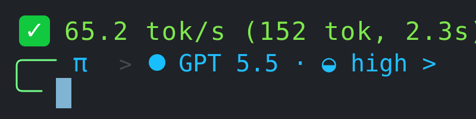

# pi-plugin-token-rate

English | [简体中文](./README.zh-CN.md)

An Oh My Pi / OMP extension that shows live assistant output speed while a response is streaming.



## Features

- Displays live output rate every 500ms.
- Shows `🚀` while streaming and `✅` after completion.
- Uses a red → yellow → green truecolor gradient based on tok/s.
- Keeps the indicator above the input box, separated from transcript content by one blank line.
- Estimates output tokens locally from stream deltas with a CJK-aware chars-per-token heuristic.

## Token counting accuracy

This plugin estimates live output tokens because most providers only expose authoritative usage at the end of a streamed response.

Current heuristic:

- Latin text: `4.0 chars/token`
- CJK text: `1.4 chars/token`
- Whitespace is ignored.
- Mixed text is weighted by CJK character ratio.

The displayed tok/s is suitable for live UX feedback, not billing-grade accounting.

## Install

### Option 1: load once

From any directory:

```bash
omp --extension /path/to/pi-plugin-token-rate
```

### Option 2: persistent config

Add the plugin path to `~/.omp/agent/config.yml`:

```yaml
extensions:
  - /path/to/pi-plugin-token-rate
```

If `extensions` already exists, append the path instead of replacing the list:

```yaml
extensions:
  - /existing/extension
  - /path/to/pi-plugin-token-rate
```

Restart `omp` after changing the config.

### Option 3: automatic discovery

Copy the plugin into OMP's user extension directory:

```bash
mkdir -p ~/.omp/agent/extensions
cp -R /path/to/pi-plugin-token-rate ~/.omp/agent/extensions/
```

Restart `omp`.

## Development

OMP loads TypeScript extension entrypoints directly with Bun. No build step is required for normal use.

Smoke-check syntax:

```bash
bun build --no-bundle index.ts --outfile /dev/null
```

Run with the local plugin:

```bash
omp --extension .
```
